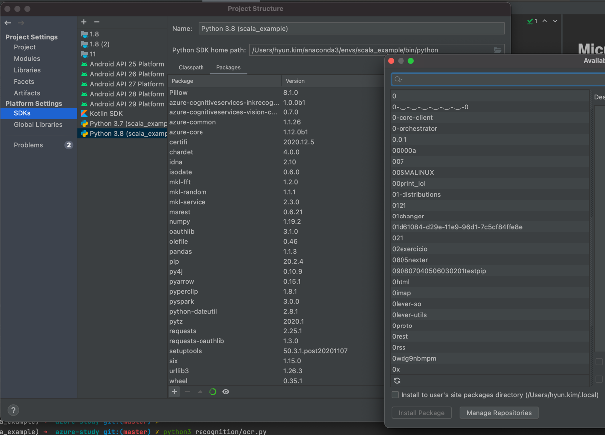

# Microsoft Azure

## Cognitive Service

### Computer Vision
- [x] [Doc](https://docs.microsoft.com/ko-kr/azure/cognitive-services/Computer-vision/quickstarts-sdk/client-library?pivots=programming-language-java&tabs=visual-studio)
- [x] [API Definition/Test](https://eastus2.dev.cognitive.microsoft.com/docs/services/computer-vision-v3-ga/operations/56f91f2e778daf14a499f20d)
- [x] [Example Quickstart Github](https://github.com/Azure-Samples/cognitive-services-quickstart-code)
- [x] [Sample Java Github](https://github.com/Azure-Samples/cognitive-services-java-sdk-samples/tree/master/Vision/ComputerVision) : shows Sample of best practice
- [x] [Sample Python Github](https://github.com/Azure-Samples/cognitive-services-python-sdk-samples)
    - [install vision api](https://pypi.org/project/azure-cognitiveservices-vision-computervision/)
        - `pip install azure-cognitiveservices-vision-computervision`
        - check pip environment
        - Virtual environment on intellij
          - add package on here
          
          - then run python by the virtual environment `/Users/hyun.kim/anaconda3/envs/scala_example/bin/python ocr.py`
    - vision sample코드가 정확하지 않음. client 생성 코드는 문서 참조